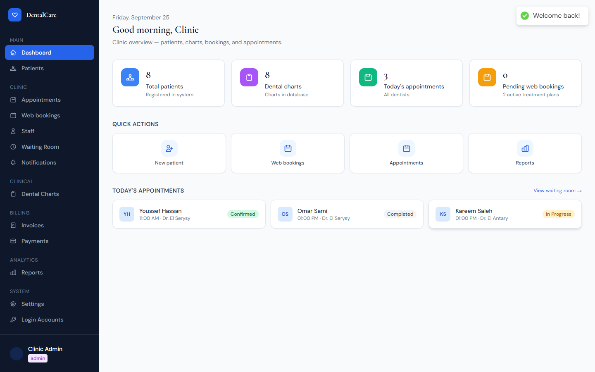
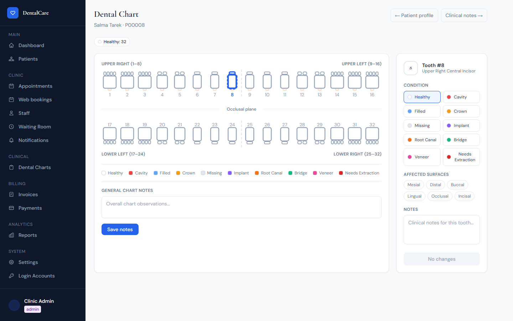
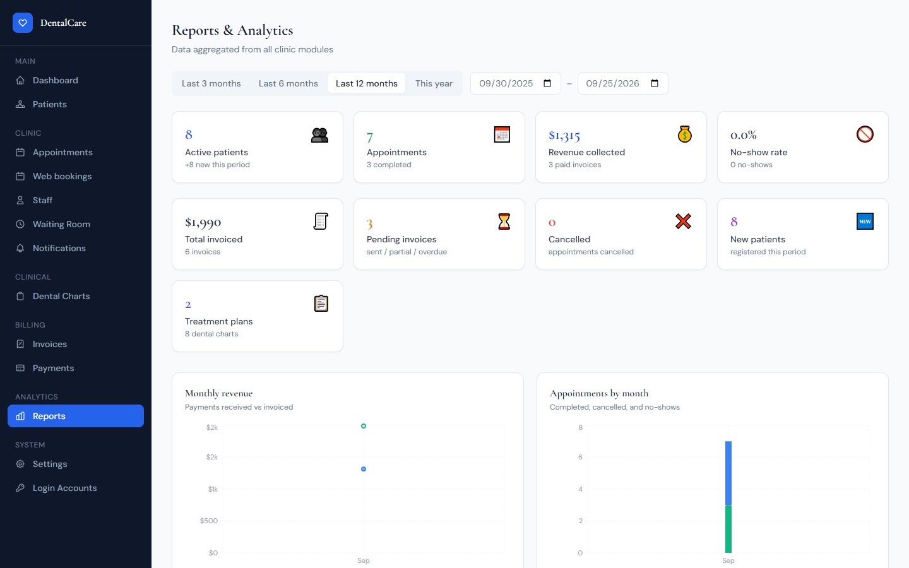
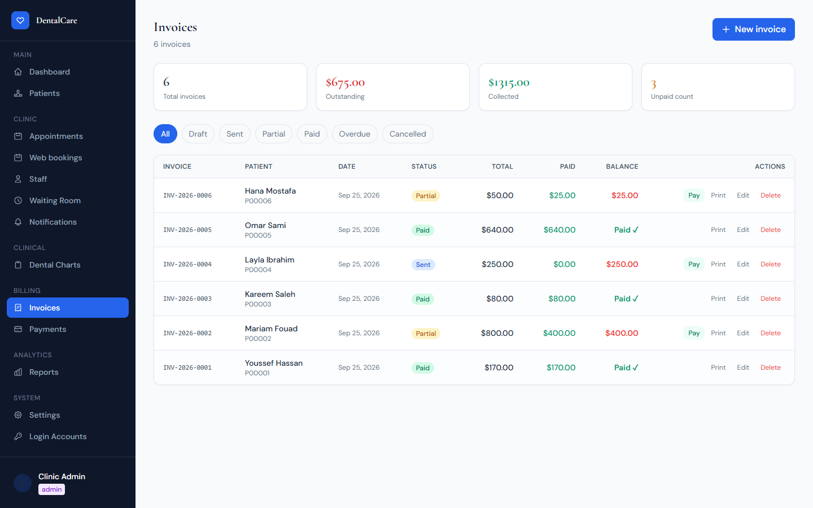
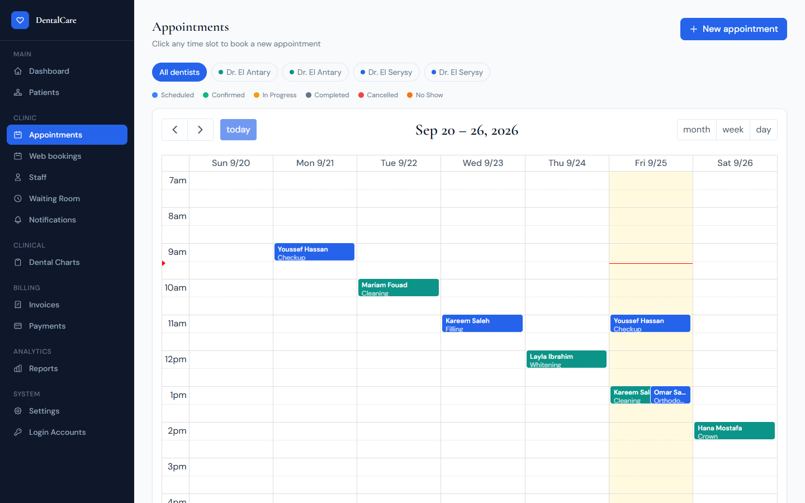
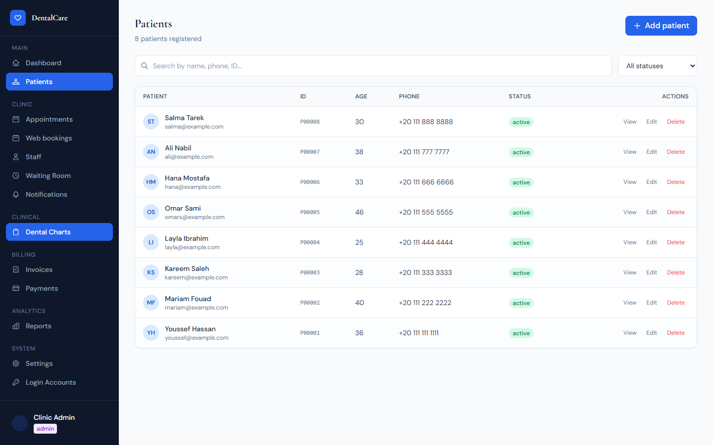
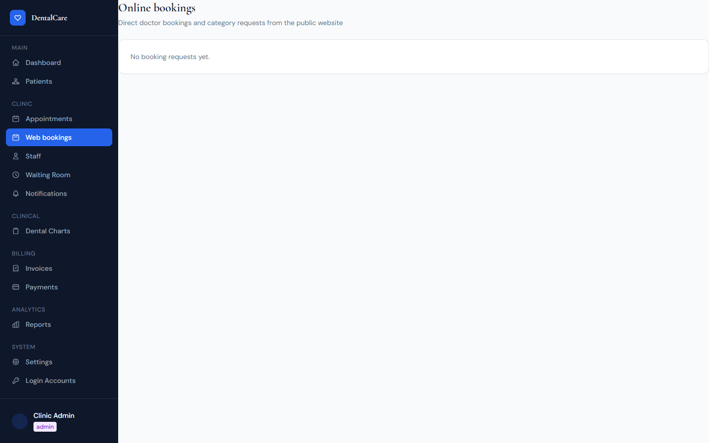
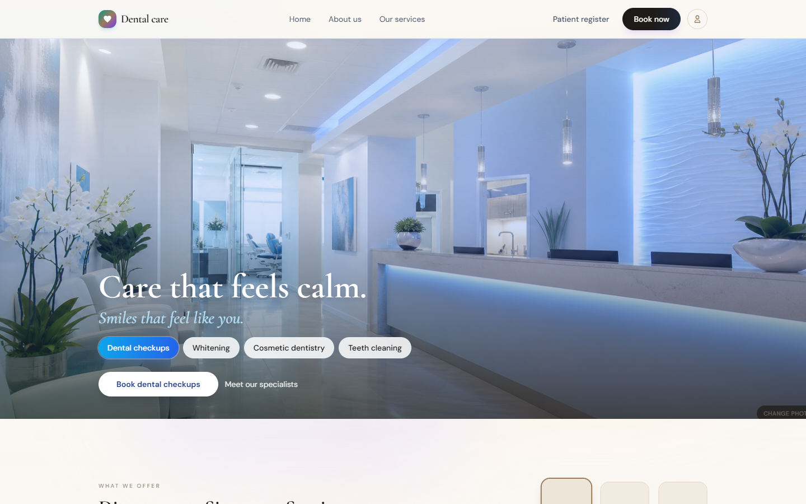
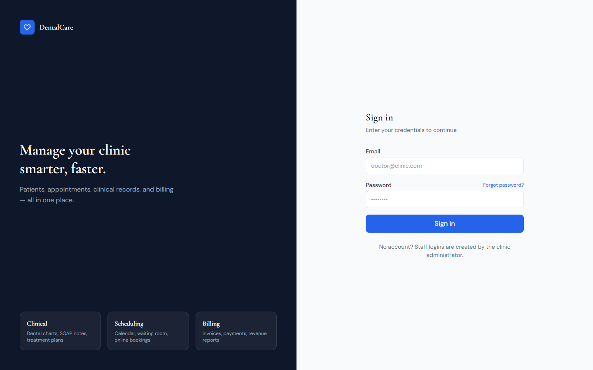

# DentalCare — Dental Management System

A full-stack web application for running a dental clinic: patients, appointments, an interactive dental chart, clinical notes, treatment plans, prescriptions, billing, reports, and a public booking website. Built on the **MERN** stack (MongoDB, Express, React, Node.js).



---

## Contents

- [Screenshots](#screenshots)
- [Try it (demo login)](#try-it-demo-login)
- [Features](#features)
- [Tech stack](#tech-stack)
- [Getting started](#getting-started)
- [Environment variables](#environment-variables)
- [Testing & code quality](#testing--code-quality)
- [Project structure](#project-structure)
- [API reference](#api-reference)
- [Roles & permissions](#roles--permissions)
- [Data models](#data-models)
- [Key design decisions](#key-design-decisions)

---

## Screenshots

| Interactive dental chart | Reports & analytics |
|---|---|
|  |  |

| Invoices & billing | Appointment calendar |
|---|---|
|  |  |

| Patients | Web bookings |
|---|---|
|  |  |

| Public website | Staff login |
|---|---|
|  |  |

---

## Try it (demo login)

There is **no public sign-up** — staff logins are created by an admin. The first admin is created
automatically on server start from two env vars, so to get a working login set these in `server/.env`:

```env
SEED_ADMIN_EMAIL=admin@smilecare.com
SEED_ADMIN_PASSWORD=Admin123!
```

Start the server, open `http://localhost:5173/login`, and sign in with:

| Email | Password | Role |
|-------|----------|------|
| `admin@smilecare.com` | `Admin123!` | Admin |

From there the admin creates logins for other staff under **Login Accounts** and **Staff**.
(These are demo credentials for local use — always use a strong password in a real deployment.)

---

## Features

**Clinic portal**

- **Patient management** — searchable, paginated list with full profiles: medical history, allergies, medications, emergency contacts.
- **Appointment calendar** — FullCalendar day/week/month view per dentist, booking and detail modals, 6 statuses, per-dentist colours, double-booking prevention.
- **Waiting room** — today's queue with one-click status flow (Scheduled → Confirmed → In Progress → Completed), auto-refreshing.
- **Interactive 32-tooth dental chart** — SVG chart with 10 condition types (healthy, cavity, filled, crown, missing, implant, root-canal, bridge, veneer, extraction-needed) and per-surface annotations.
- **SOAP clinical notes** — structured Subjective / Objective / Assessment / Plan notes linked to appointments, with procedures, vitals, and follow-up dates.
- **Treatment plans** — multi-procedure plans with cost estimates, per-procedure status, discounts, and approval; one click turns a plan into an invoice.
- **Prescriptions** — printable prescriptions with medication, dosage, frequency, duration, and dispensing tracking.
- **Invoices & payments** — full billing lifecycle (draft → sent → partial → paid), tax/discount/insurance, printable invoice, payment recording, and automatic status recalculation.
- **Reports & analytics** — KPI tiles plus Recharts graphs (monthly revenue, appointments by month/type, patient growth, revenue by dentist, payment methods, top procedures) over a configurable date range.
- **Notifications** — in-app and email notifications, with appointment reminders. Records honestly reflect delivery (sent / pending / failed).

**Public website**

- Marketing pages (home, about, services, doctors, contact) plus **online booking** and **patient self-registration**.
- Website bookings flow through the clinic: front desk assigns a dentist → dentist approves → front desk confirms and the patient is emailed. Availability is checked against the dentist's schedule and existing appointments.

---

## Tech stack

**Backend:** Node.js, Express, Mongoose (MongoDB), JWT (`jsonwebtoken`) + `bcryptjs`, `helmet`, `express-rate-limit`, `nodemailer`, `dotenv`, `cors`. Tests: Node's built-in test runner + `supertest` + `mongodb-memory-server`.

**Frontend:** React 19, Vite, React Router, Axios, Tailwind CSS, FullCalendar, Recharts, react-hot-toast.

**Tooling:** ESLint 9 (flat config) and Prettier on both packages.

---

## Getting started

### Prerequisites
- Node.js 18+
- MongoDB (local or Atlas)
- npm

### 1. Clone
```bash
git clone https://github.com/adhamelsonny014-dot/dental-management-system.git
cd dental-management-system/dental
```

### 2. Server
```bash
cd server
npm install
cp .env.example .env     # then edit .env (see below)
npm run dev              # http://localhost:4000
```

### 3. Client
```bash
cd ../client
npm install
npm run dev              # http://localhost:5173
```

The Vite dev server proxies `/api` to the backend, so no client config is needed. Sign in with the
[demo login](#try-it-demo-login) above.

---

## Environment variables

Create `server/.env` (a template is in `server/.env.example`):

```env
PORT=4000
MONGO_URI=mongodb://localhost:27017/dental_management
JWT_SECRET=change_this_to_a_long_random_string
CLIENT_URL=http://localhost:5173
SEED_ADMIN_EMAIL=admin@smilecare.com
SEED_ADMIN_PASSWORD=Admin123!
```

| Variable | Description | Default |
|----------|-------------|---------|
| `PORT` | Server port | `4000` |
| `MONGO_URI` | MongoDB connection string | *(required)* |
| `JWT_SECRET` | Secret for signing JWTs | *(required)* |
| `CLIENT_URL` | Frontend origin for CORS | `http://localhost:5173` |
| `SEED_ADMIN_EMAIL` | Admin created on first start | `admin@smilecare.com` |
| `SEED_ADMIN_PASSWORD` | Password for that admin (no admin created if empty) | — |
| `SEED_DOCTOR_PASSWORD` | Password for the two demo doctor logins (random & printed to the log if empty) | — |
| `SMTP_HOST` … `SMTP_FROM` | Optional SMTP settings; patient emails are sent when set | — |

The server refuses to start if `MONGO_URI` or `JWT_SECRET` is missing, and connects to the database before it accepts requests.

---

## Testing & code quality

```bash
cd server
npm test          # 28 API tests on a throwaway in-memory MongoDB
npm run lint      # ESLint
npm run format    # Prettier

cd ../client
npm run lint
npm run build
```

The server test suite (`server/tests/api.test.js`) spins up a real in-memory MongoDB and exercises the
Express app end-to-end: authentication and role guards, error codes, patient numbering and cascade
delete, the billing lifecycle, report totals, the full website-booking flow, and notification delivery.

**Security measures:** `helmet` headers; rate limits on login and the public forms; a per-model field
allowlist so requests can't set server-managed fields (`patientNumber`, `receiptNumber`, `createdBy`,
`role`); role-based route guards; dentists scoped to their own patients; bcrypt password hashing; and
HTML-escaped emails. See [`SECURITY_ASSESSMENT.md`](dental/SECURITY_ASSESSMENT.md) for a source review.

---

## Project structure

```
dental/
├── server/
│   ├── app.js                 # Express app: middleware, routes, error handling
│   ├── index.js               # Startup: env check → DB connect → listen
│   ├── database.js
│   ├── Models/                # Mongoose schemas (User, Patient, Staff, Appointment, …, Counter)
│   ├── Controllers/           # One controller per resource
│   ├── Routers/               # One router per resource (role guards live here)
│   ├── middleware/
│   │   ├── auth.js            # JWT protect + requireRole
│   │   └── errorHandler.js    # notFound + central error handler
│   ├── utils/                 # asyncHandler, paginate, fields (allowlist), sequence,
│   │   │                      # slots, appointmentValidation, dentistScope, notify, mailer
│   ├── seed/featuredDoctors.js
│   └── tests/api.test.js
│
└── client/
    ├── src/
    │   ├── pages/             # Route-level pages (staff portal + public/)
    │   ├── components/        # Shared UI + per-feature folders
    │   │   │                  #   invoices/, treatmentPlans/, prescriptions/, public/
    │   ├── hooks/             # useDentists, usePatient, useClinic
    │   ├── constants/teeth.js
    │   ├── context/AuthContext.jsx
    │   ├── utils/             # api.js (Axios + JWT), format.js
    │   └── App.jsx            # Routes, lazy-loaded pages
    ├── eslint.config.js
    └── vite.config.js
```

---

## API reference

All protected routes require `Authorization: Bearer <token>`. "Auth" shows the minimum role.

### Authentication — `/api/auth`
| Method | Path | Auth | Description |
|--------|------|------|-------------|
| POST | `/login` | — | Get a JWT |
| GET | `/me` | Any | Current user |
| POST | `/admin/create-account` | Admin | Create a staff login |
| GET / PUT / DELETE | `/admin/accounts[/:id]` | Admin | List / update / delete logins |

### Core resources
| Resource | Base path | Notes |
|----------|-----------|-------|
| Clinic settings | `/api/clinic` | `GET` any · `PUT` admin |
| Patients | `/api/patients` | list/get/create/update any · **delete admin** · dentists see only their own |
| Staff | `/api/staff` | admin-only writes · `POST /:id/create-account` issues a login |
| Appointments | `/api/appointments` | double-booking checked on create/update |
| Dental chart | `/api/dental-chart/:patientId` | auto-creates a 32-tooth chart |
| Clinical notes | `/api/clinical-notes` | read: any staff · **write: admin, dentist** |
| Treatment plans | `/api/treatment-plans` | write: admin, dentist · `POST` invoice `/from-plan/:planId` |
| Prescriptions | `/api/prescriptions` | write: admin, dentist · `PATCH /:id/dispense` |
| Invoices | `/api/invoices` | **write: admin, receptionist** · delete admin |
| Payments | `/api/payments` | create: admin, receptionist · auto-syncs invoice status |
| Reports | `/api/reports/*` | admin, receptionist · `?start=&end=` (end is inclusive of the day) |
| Notifications | `/api/notifications` | own notifications; delivery status recorded |
| Public | `/api/public/*` | clinic info, staff, slots, contact, booking, patient registration |

---

## Roles & permissions

| Action | Admin | Dentist | Receptionist | Assistant |
|--------|:-----:|:-------:|:------------:|:---------:|
| View patients | ✅ | ✅ (own) | ✅ | ✅ |
| Create / edit patients | ✅ | ✅ | ✅ | ✅ |
| Delete patients (+ their records) | ✅ | ❌ | ❌ | ❌ |
| Manage staff & logins | ✅ | ❌ | ❌ | ❌ |
| Book appointments | ✅ | ✅ | ✅ | ✅ |
| Clinical notes / treatment plans / prescriptions | ✅ | ✅ | ❌ | ❌ |
| Edit dental chart | ✅ | ✅ | ❌ | ✅ |
| Invoices & payments | ✅ | ❌ | ✅ | ❌ |
| Clinic settings & reports | ✅ | ❌ | ✅ | ❌ |

Enforced by `requireRole(...roles)` on the routers, plus per-patient scoping for dentists.

---

## Data models

Twelve Mongoose models: **User, Clinic, Patient, Staff, Appointment, DentalChart, ClinicalNote,
TreatmentPlan, Prescription, Invoice, Payment, Notification** (plus **Counter** for numbering).

Highlights:
- **Patient** — auto `patientNumber` (`P00001`), medical history, `createdBy`.
- **DentalChart** — one per patient, 32 teeth each with condition + surfaces.
- **Invoice** — line items with virtual `subtotal` / `discountAmount` / `taxAmount` / `grandTotal` / `amountDue`; auto `INV-YYYY-0001`.
- **Payment** — auto `RCP-…`; creating/reversing one recalculates the invoice status.
- **Counter** — backs all auto-numbers so IDs are never reused after a deletion.

---

## Key design decisions

- **Numbering never reuses IDs** — patient/invoice/receipt/prescription numbers come from an atomic `Counter`, so deleting a record can't cause a duplicate-key clash on the next one.
- **Invoice status is derived, never set by hand** — `syncStatus()` recalculates draft/sent/partial/paid from the payments each time one changes.
- **No data leakage from writes** — every create/update runs through a field allowlist (`utils/fields.js`).
- **Errors are centralised** — controllers are wrapped in `asyncHandler`; one error handler maps Mongoose errors to 400/404/409 and returns JSON.
- **Public site loads lean** — pages are lazy-loaded, so a visitor booking online doesn't download the calendar/chart code used by the staff portal.
- **Bookings can't double-book** — website confirmations validate the dentist's schedule and existing appointments before creating one.

---

## Not included (future work)

Insurance claims, lab orders, a patient-facing portal, X-ray/file uploads, SMS sending (email works when SMTP is set), and recurring appointments.

---

Built for the Advanced Web Programming course. Licensed under the [MIT License](LICENSE).
